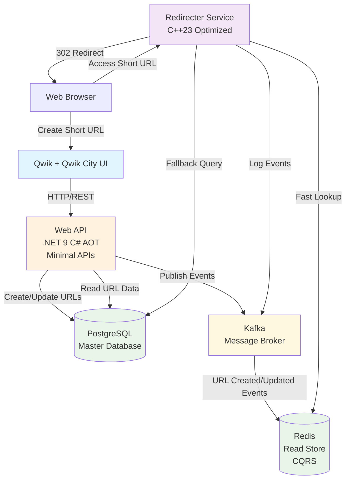
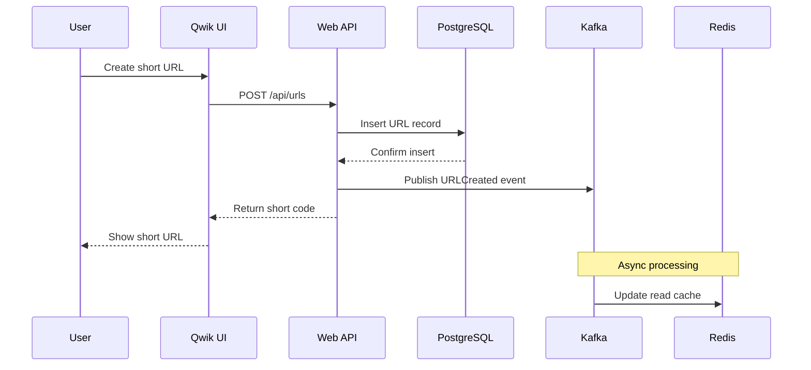
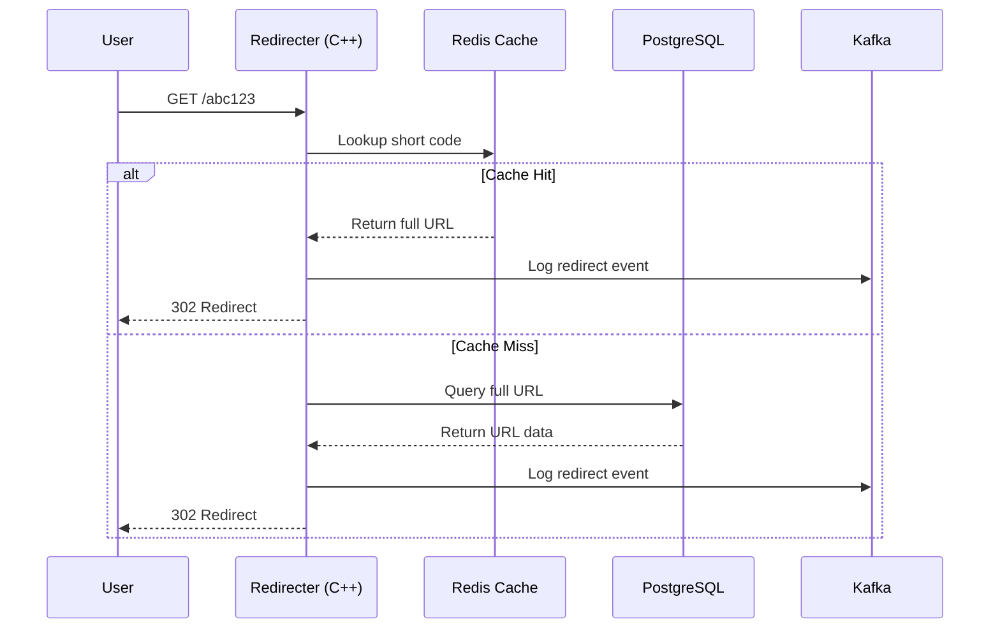
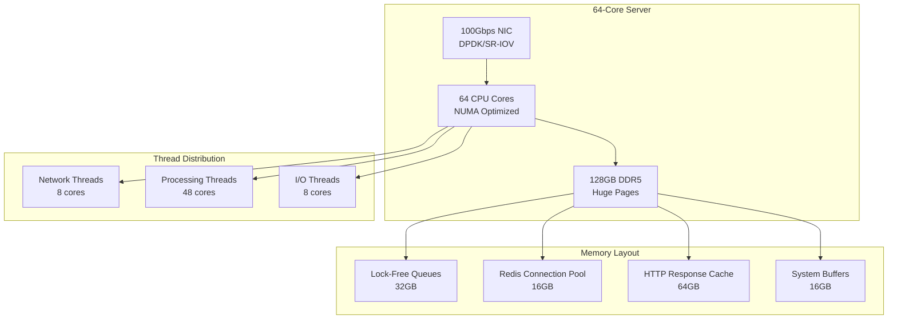

# shrtnr Architecture

## System Overview

## Data Flow Patterns

### 1. URL Creation Flow (CQRS Write Side)

### 2. URL Redirect Flow (CQRS Read Side)

## Service Responsibilities

### Redirecter Service (C++23)
- **Primary Function**: Ultra-high-performance URL redirects
- **Read Pattern**: Redis first with async I/O, PostgreSQL fallback
- **Logging**: Kafka events for analytics with zero-copy serialization
- **Performance Target**: Sub-500μs response times with modern C++23 optimizations
- **Modern Features**: std::expected error handling, coroutines, SIMD optimizations

### Web API (.NET 9 C# AOT)
- **CRUD Operations**: URL management with EF Core 9
- **Authentication**: JWT Bearer token validation
- **Analytics**: Statistics and reporting with source generation
- **Event Publishing**: Kafka integration with reflection-free serialization
- **Performance**: Native AOT for <50ms startup and minimal memory usage
- **Serialization**: System.Text.Json source generators for AOT compatibility

### Redis (Read Store)
- **Data Model**: Simple key-value (short_code → full_url)
- **TTL**: Configurable expiration
- **Performance**: In-memory for fastest lookups

### PostgreSQL (Write Store)
- **Full Data Model**: URLs, users, analytics, metadata
- **Consistency**: ACID transactions
- **Features**: Complex queries, reporting, backups

### Kafka (Event Streaming)
- **Events**: URL creation, updates, redirects, analytics
- **Consumers**: Redis sync, analytics processing
- **Scalability**: Horizontal scaling support

## Modern Technology Integration

### .NET 9 AOT Performance Benefits
- **Cold Start**: <50ms application startup
- **Memory Efficiency**: 70% reduction in memory usage compared to JIT
- **Deployment Size**: Self-contained binaries with trimming
- **CPU Performance**: Ahead-of-time optimizations eliminate JIT overhead

### C++23 Advanced Features
- **Error Handling**: `std::expected<T, Error>` for exception-free error propagation
- **Async Operations**: Coroutines for non-blocking I/O with Redis/PostgreSQL
- **Type Safety**: Concepts for compile-time interface validation
- **Performance**: SIMD instructions and branch prediction hints

### Source Generation Advantages
- **JSON Serialization**: Zero-reflection serialization for API responses
- **EF Core Queries**: Pre-compiled LINQ expressions
- **Configuration Binding**: Compile-time validated configuration objects
- **HTTP Routing**: Generated route handlers with parameter validation

### Memory and Performance Optimizations

#### C++23 Redirecter (1M+ RPS Target)
- **Response Time**: <100μs (p99) with extreme optimizations
- **Throughput**: 1,000,000+ requests per second per instance
- **Zero-Copy Networking**: Custom memory pools and DPDK integration
- **Lock-Free Architecture**: Concurrent data structures and atomic operations
- **NUMA-Aware Threading**: CPU affinity and memory locality optimizations
- **Vectorized Operations**: AVX-512 for URL processing and string operations
- **Kernel Bypass**: io_uring or DPDK for maximum network performance

#### .NET 9 API Optimizations
- **Source-Generated Serialization**: Zero-reflection JSON processing
- **Pooled HTTP Contexts**: Reduced allocation overhead
- **Connection Multiplexing**: Efficient Redis and PostgreSQL connections
- **Batch Processing**: Grouped operations for reduced latency

#### Infrastructure Scaling
- **Redis Clustering**: Horizontal scaling with consistent hashing
- **Connection Pooling**: Per-thread pools to avoid contention
- **Load Balancing**: Hardware load balancers with session affinity
- **Monitoring**: Real-time performance metrics and alerting

## Million RPS Deployment Architecture

### Single Instance Performance

### Multi-Instance Scaling
- **Load Balancer**: Hardware L4 load balancer (F5, Citrix)
- **Instance Count**: 4-8 instances per physical server
- **Resource Isolation**: CPU and memory partitioning
- **Failover**: Active-active with health checks